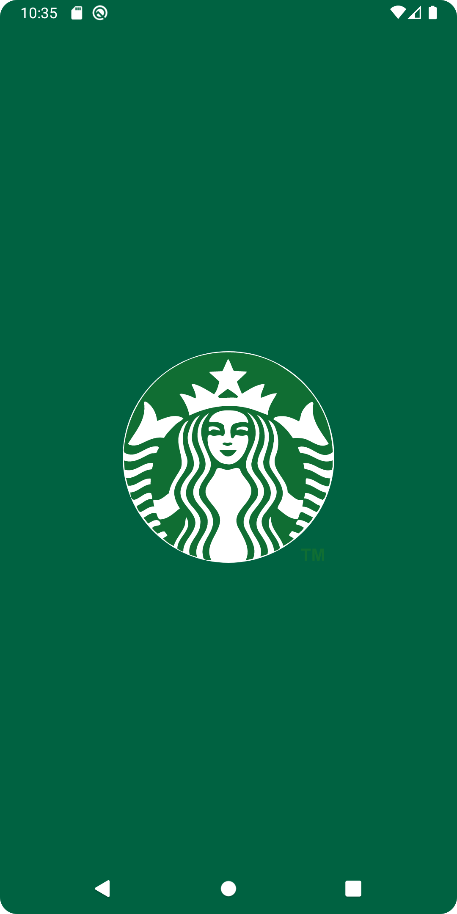

<h1 align=center>Starbucks Compose</h1>

<h3 align=center>Overview</h3>

A Jetpack compose clone of the Starbucks India mobile app. The purpose of this app is to build an android app using the Modern Android Development practices such as Jetpack Compose , Clean Architecture and also to build the app following the design principles mentioned in the official starbucks [design guide](https://creative.starbucks.com/)

 

### Stack
| Tools | Link |
|     :---      |          :---: |
| 🤖 Kotlin | [Kotlin](https://kotlinlang.org) |
| 💚 Jetpack Compose | [Jetpack Compose](https://developer.android.com/jetpack/compose) |
| 🏛 Architecture Components | [Android Architecture Components](https://developer.android.com/topic/libraries/architecture) |
| 💉 Dagger Hilt | [Dagger Hilt](https://developer.android.com/training/dependency-injection/hilt-android) |
| 🌐 Material Design | [Material Design](https://developer.android.com/jetpack/androidx/releases/compose-material) |
| 🌊 Coroutines | [Kotlin Coroutines](https://developer.android.com/kotlin/coroutines) |
| 🏄🏼‍♀️ Flows | [Flows](https://developer.android.com/kotlin/flow) |

### Screenshots

<table style="width:100%">
  <tr>
    <th>Splash</th>
  </tr>
  <tr>
    <td></td>
  </tr>
</table>
